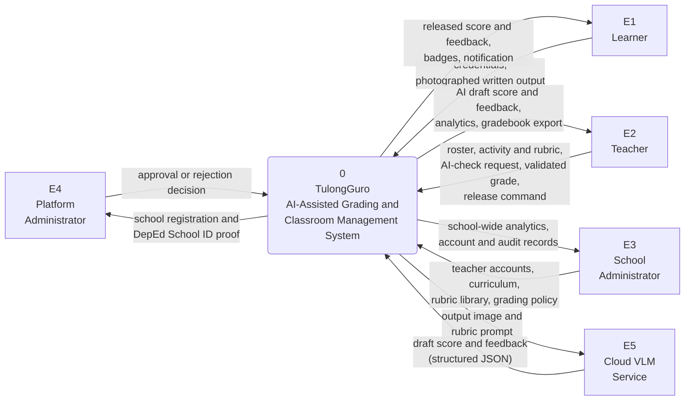
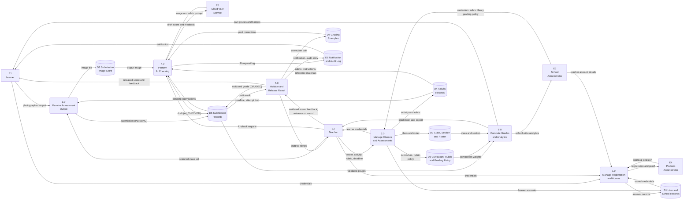

# TulongGuro — Data Flow Diagram

For inclusion in Chapter 3 (Methodology / System Design) and the appendix.

Notation: **Gane–Sarson**. Rounded rectangle = process, plain rectangle =
external entity, open-ended rectangle = data store. The Mermaid renderings
below draw data stores as cylinders because Mermaid has no open-ended-rectangle
shape; when redrawing in Visio or draw.io, use the open-ended rectangle.

---

## 1. Elements

### External entities

| ID | Entity | Role |
|----|--------|------|
| E1 | Learner | Views assigned activities, photographs and submits written work, receives released results |
| E2 | Teacher | Builds classes and activities, triggers AI checking, validates and releases grades |
| E3 | School Administrator | Manages teacher accounts, curriculum, the rubric library, and grading policy |
| E4 | Platform Administrator | Approves or rejects school registrations against DepEd records |
| E5 | Cloud VLM Service | External vision-language model that returns a draft score and feedback |

### Processes

| ID | Process |
|----|---------|
| 1.0 | Manage Registration and Access |
| 2.0 | Manage Classes and Assessments |
| 3.0 | Receive Assessment Output |
| 4.0 | Perform AI Checking |
| 5.0 | Validate and Release Result |
| 6.0 | Compute Grades and Analytics |

### Data stores

| ID | Data store | Backing tables |
|----|------------|----------------|
| D1 | User and School Records | `School`, `User` |
| D2 | Class, Section and Roster | `Section`, `Class`, `ClassLesson`, `SectionTransfer` |
| D3 | Curriculum, Rubric and Grading Policy | `Curriculum`, `CurriculumLesson`, `RubricTemplate`, `GradingPolicy` |
| D4 | Activity Records | `Activity` |
| D5 | Submission Records | `Submission` |
| D6 | Submission Image Store | Cloud object storage (submission photographs) |
| D7 | Grading Examples | `GradingExample` |
| D8 | Notification and Audit Log | `Notification`, `PushSubscription`, `GradingAuditLog`, `AdminAuditLog`, `AiRequestLog` |

---

## Figure 3. Context Diagram (Level 0)

---

## Figure 4. Level 1 Data Flow Diagram

Designed for a **landscape** page.

---

## 2. Data flow table

The authoritative list. Use it when redrawing the diagram, and to check that
every flow on the drawing is labelled.

### Process 1.0 — Manage Registration and Access

| # | From | Data flow | To |
|---|------|-----------|-----|
| 1.1 | E2 Teacher | School registration details, DepEd School ID, proof document | 1.0 |
| 1.2 | 1.0 | Pending school registration and proof | E4 Platform Administrator |
| 1.3 | E4 Platform Administrator | Approval or rejection decision | 1.0 |
| 1.4 | 1.0 | School and staff account record | D1 |
| 1.5 | E1 / E2 / E3 | Username and password | 1.0 |
| 1.6 | D1 | Stored credential hash and school status | 1.0 |
| 1.7 | 1.0 | Session token, or error / pending notice | E1 / E2 / E3 |
| 1.8 | E3 School Administrator | Teacher account details, password reset | 1.0 |
| 1.9 | 1.0 | Account and administrative audit entry | D8 |

### Process 2.0 — Manage Classes and Assessments

| # | From | Data flow | To |
|---|------|-----------|-----|
| 2.1 | E2 Teacher | Section details and class roster | 2.0 |
| 2.2 | 2.0 | Section, class and roster record | D2 |
| 2.3 | 2.0 | Generated learner account and password hash | D1 |
| 2.4 | 2.0 | Learner login credentials (one-time display) | E2 Teacher |
| 2.5 | E3 School Administrator | Curriculum, lessons, rubric library, grading policy weights | 2.0 |
| 2.6 | 2.0 | Curriculum, rubric template and policy record | D3 |
| 2.7 | D3 | Rubric template, curriculum lesson, competency list | 2.0 |
| 2.8 | E2 Teacher | Activity details, rubric, deadline, reference materials | 2.0 |
| 2.9 | 2.0 | Activity record | D4 |

### Process 3.0 — Receive Assessment Output

| # | From | Data flow | To |
|---|------|-----------|-----|
| 3.1 | E1 Learner | Photographed written output | 3.0 |
| 3.2 | E2 Teacher | Scanned class set (batch upload) | 3.0 |
| 3.3 | D4 | Deadline, late window, attempt limit, submission mode | 3.0 |
| 3.4 | 3.0 | Combined output image | D6 |
| 3.5 | 3.0 | Submission record, status PENDING | D5 |
| 3.6 | 3.0 | Submission confirmation or refusal notice | E1 / E2 |

### Process 4.0 — Perform AI Checking

| # | From | Data flow | To |
|---|------|-----------|-----|
| 4.1 | E2 Teacher | AI-check request for an activity | 4.0 |
| 4.2 | D5 | Pending submissions for the activity | 4.0 |
| 4.3 | D6 | Output image for each submission | 4.0 |
| 4.4 | D4 | Rubric, instructions, reference materials | 4.0 |
| 4.5 | D7 | Three most recent teacher corrections for the same activity type and grade level | 4.0 |
| 4.6 | 4.0 | Output image and assembled rubric prompt | E5 Cloud VLM Service |
| 4.7 | E5 Cloud VLM Service | Draft score and feedback (structured JSON) | 4.0 |
| 4.8 | 4.0 | Draft score and feedback, status AI_CHECKED | D5 |
| 4.9 | 4.0 | AI request log entry (tokens, model, outcome) | D8 |
| 4.10 | 4.0 | Job progress and per-paper outcome | E2 Teacher |

### Process 5.0 — Validate and Release Result

| # | From | Data flow | To |
|---|------|-----------|-----|
| 5.1 | D5 | Draft score, feedback and output image | 5.0 |
| 5.2 | 5.0 | Draft presented for review | E2 Teacher |
| 5.3 | E2 Teacher | Validated score and feedback (approved, edited or overridden) | 5.0 |
| 5.4 | 5.0 | Validated grade, status GRADED | D5 |
| 5.5 | 5.0 | AI draft paired with the teacher's correction | D7 |
| 5.6 | 5.0 | Grading audit entry | D8 |
| 5.7 | E2 Teacher | Release command | 5.0 |
| 5.8 | 5.0 | Release timestamp | D5 |
| 5.9 | 5.0 | Notification record and push message | D8 |
| 5.10 | 5.0 | Released score and feedback | E1 Learner |

### Process 6.0 — Compute Grades and Analytics

| # | From | Data flow | To |
|---|------|-----------|-----|
| 6.1 | D5 | Validated, released, non-excused grades | 6.0 |
| 6.2 | D3 | Component weights for the subject | 6.0 |
| 6.3 | D2 | Class, section and enrolment | 6.0 |
| 6.4 | 6.0 | Initial grade, transmuted final grade, descriptor band | E2 Teacher |
| 6.5 | 6.0 | Gradebook export file | E2 Teacher |
| 6.6 | 6.0 | Own grades, skill progress and badges | E1 Learner |
| 6.7 | 6.0 | Awarded badge record | D1 |
| 6.8 | 6.0 | School-wide performance analytics | E3 School Administrator |
| 6.9 | D8 | Notification | E1 Learner |

---

## 3. Draft paragraph for the paper

> The movement of data through TulongGuro was modelled using a data flow
> diagram. The context diagram identifies five external entities: the learner,
> the teacher, the school administrator, the platform administrator, and the
> cloud-based vision-language model that performs the AI checking. Decomposing
> the system yields six processes — managing registration and access, managing
> classes and assessments, receiving assessment output, performing AI checking,
> validating and releasing results, and computing grades and analytics — which
> exchange data through eight stores covering user and school records, class and
> roster data, curriculum and rubric definitions, activity records, submission
> records, the submission image store, stored grading examples, and the
> notification and audit log.
>
> Two flows in the diagram carry the design intent of the system. The first is
> the flow from the grading example store into the AI checking process, which
> supplies the teacher's own prior corrections as calibration input, so the model
> is guided by that teacher's marking rather than by a generic standard. The
> second is the separation between the validated grade written to the submission
> store and the release timestamp that follows it, which is what prevents an
> unreviewed result from reaching a learner. The context diagram and the level 1
> data flow diagram are presented in Appendix [X].
