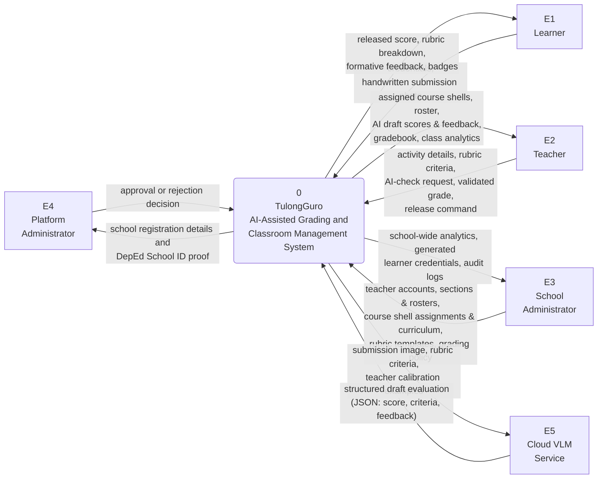
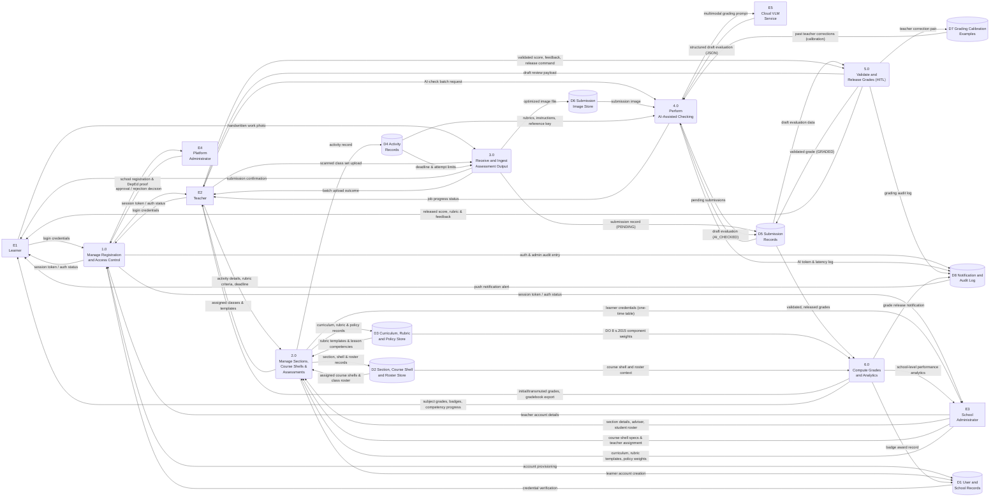

# TulongGuro — Data Flow Diagram

For inclusion in Chapter 3 (Methodology / System Design) and the Appendix.

Notation: **Gane–Sarson**. Rounded rectangle = process, plain rectangle =
external entity, open-ended rectangle = data store. The Mermaid renderings
below draw data stores as cylinders because Mermaid has no native open-ended-rectangle
shape; when redrawing in Visio or draw.io, use the standard open-ended rectangle.

---

## 1. System Elements

### External Entities

| ID | Entity | Role in System |
|----|--------|----------------|
| **E1** | **Learner** | Accesses assigned activities, captures and uploads handwritten submissions, views released grades, criteria breakdowns, qualitative feedback, and earned skill badges. |
| **E2** | **Teacher** | Accesses assigned course shells, designs activities and selects/customizes rubrics, sets deadlines, triggers AI checking, reviews and overrides AI drafts in the HITL workspace, and releases final grades. |
| **E3** | **School Administrator** | Manages teacher accounts, creates block sections and rosters, creates course shells and assigns them to subject teachers, reassigns course shells/advisers, establishes curriculum and rubric templates, and configures DepEd grading policies. |
| **E4** | **Platform Administrator** | Verifies school registrations and DepEd School ID credentials, approving or rejecting institutional onboarding requests. |
| **E5** | **Cloud VLM Service** | External Multimodal Vision-Language Model (Gemini) that processes student submission images alongside rubric prompts to return structured draft scores and formative feedback. |

---

### Processes

| ID | Process | Description |
|----|---------|-------------|
| **1.0** | **Manage Registration and Access Control** | Handles school institutional registration, DepEd ID verification, account provisioning, authentication, session token issuance, and role-based access control. |
| **2.0** | **Manage Sections, Course Shells, and Assessments** | Centralizes admin-driven section and roster management, course shell creation and teacher assignment/reassignment, curriculum and rubric template ingestion, and teacher activity authoring. |
| **3.0** | **Receive and Ingest Assessment Output** | Ingests handwritten student submissions (via mobile capture or batch teacher upload), validates deadlines and attempt constraints, and stores image artifacts securely. |
| **4.0** | **Perform AI-Assisted Checking** | Assembles contextual grading prompts (rubrics, instructions, reference keys, teacher calibration examples), calls the Cloud VLM, validates JSON payloads, and persists draft evaluations. |
| **5.0** | **Validate and Release Grades (HITL)** | Facilitates teacher review and override of AI drafts, captures teacher corrections for model calibration, records grading audit logs, and controls deliberate grade release to learners. |
| **6.0** | **Compute Grades and Analytics** | Applies DepEd Order No. 8, s. 2015 weighting (WW, PT, QA) and transmutation formulas, recalculates classroom and school-wide performance metrics, awards badges, and generates exportable gradebooks. |

---

### Data Stores

| ID | Data Store | Backing Relational Tables & Storage |
|----|------------|-------------------------------------|
| **D1** | **User and School Records** | `School`, `User`, `StudentBadge` |
| **D2** | **Section, Course Shell, and Roster Store** | `Section`, `Class` (Course Shell), `ClassLesson`, `SectionTransfer` |
| **D3** | **Curriculum, Rubric, and Policy Store** | `Curriculum`, `CurriculumLesson`, `RubricTemplate`, `GradingPolicy` |
| **D4** | **Activity Records** | `Activity` |
| **D5** | **Submission Records** | `Submission` |
| **D6** | **Submission Image Store** | Cloud Object Storage (Supabase Storage submission photographs) |
| **D7** | **Grading Calibration Examples** | `GradingExample` (Few-shot teacher correction pairs) |
| **D8** | **Notification and Audit Log** | `Notification`, `PushSubscription`, `GradingAuditLog`, `AdminAuditLog`, `AiRequestLog` |

---

## Figure 3. Context Diagram (Level 0 DFD)

---

## Figure 4. Level 1 Data Flow Diagram

---

## 2. Authoritative Data Flow Table

### Process 1.0 — Manage Registration and Access Control

| Flow # | Source | Data Flow Content | Destination |
|:------:|:-------|:------------------|:------------|
| 1.1 | E2 Teacher / Applicant | School registration details, DepEd School ID, proof document | 1.0 |
| 1.2 | 1.0 | Pending school registration data and DepEd proof document | E4 Platform Administrator |
| 1.3 | E4 Platform Administrator | Institutional verification decision (Approve / Reject) | 1.0 |
| 1.4 | 1.0 | Verified school entity and initial admin account record | D1 User and School Records |
| 1.5 | E1 / E2 / E3 | User credentials (Username / Password) | 1.0 |
| 1.6 | D1 User and School Records | Stored argon2/bcrypt password hash, role, and school approval state | 1.0 |
| 1.7 | 1.0 | JWT session token, role permissions, or authentication failure notice | E1 / E2 / E3 |
| 1.8 | E3 School Administrator | Teacher account provisioning (Name, Email, Temporary Password) | 1.0 |
| 1.9 | 1.0 | User account creation and administrative audit entry | D8 Notification & Audit Log |

---

### Process 2.0 — Manage Sections, Course Shells, and Assessments

> **Key Architectural Rule:** Course shells and block sections are strictly provisioned by the **School Administrator (E3)**. The administrator assigns course shells to subject teachers. The **Teacher (E2)** operates within assigned shells to construct classroom activities and configure assessment rubrics.

| Flow # | Source | Data Flow Content | Destination |
|:------:|:-------|:------------------|:------------|
| 2.1 | E3 School Administrator | Section metadata (Name, Grade Level, School Year, Adviser Teacher ID) | 2.0 |
| 2.2 | E3 School Administrator | Student roster data (Learner Names, LRN, Birthdates) | 2.0 |
| 2.3 | 2.0 | Section entity and section roster enrolment mapping | D2 Section, Shell & Roster |
| 2.4 | 2.0 | Provisioned learner account records (`<SCHOOL>-<YY>-<NNNN>`) | D1 User and School Records |
| 2.5 | 2.0 | Learner login credentials table (one-time display and copyable export) | E3 School Administrator |
| 2.6 | E3 School Administrator | Course shell creation specs (Subject, Grade Level, Section ID, Teacher ID, Curriculum ID) | 2.0 |
| 2.7 | 2.0 | Course shell record (`Class`) linked to Section and Assigned Teacher | D2 Section, Shell & Roster |
| 2.8 | E3 School Administrator | Curriculum guide, lesson competencies, school rubric templates, DepEd grading policy weights | 2.0 |
| 2.9 | 2.0 | Curriculum hierarchy, lesson competencies, and school rubric template records | D3 Curriculum, Rubric & Policy |
| 2.10 | D2 Section, Shell & Roster | Assigned course shells (`Class.teacherId`) and section student rosters | 2.0 |
| 2.11 | D3 Curriculum, Rubric & Policy | Published school rubric templates and curriculum learning competencies | 2.0 |
| 2.12 | 2.0 | Assigned course shells, enrolled student lists, and template rubrics | E2 Teacher |
| 2.13 | E2 Teacher | Activity definition (Title, Instructions, Component Type [WW/PT/QA], Rubric Criteria, Max Score, Deadline, Reference Materials) | 2.0 |
| 2.14 | 2.0 | Activity record with attached rubric criteria and reference files | D4 Activity Records |
| 2.15 | E3 School Administrator | Course shell reassignment command (New Teacher ID) or Section Adviser update | 2.0 |
| 2.16 | 2.0 | Updated course shell teacher assignment / section adviser record | D2 Section, Shell & Roster |

---

### Process 3.0 — Receive and Ingest Assessment Output

| Flow # | Source | Data Flow Content | Destination |
|:------:|:-------|:------------------|:------------|
| 3.1 | E1 Learner | Captured photograph of handwritten activity work | 3.0 |
| 3.2 | E2 Teacher | Scanned multi-student paper batch upload | 3.0 |
| 3.3 | D4 Activity Records | Activity deadline, late submission window, attempt limits, submission mode | 3.0 |
| 3.4 | 3.0 | Processed and optimized submission image file | D6 Submission Image Store |
| 3.5 | 3.0 | Submission entry (Image URL, timestamp, attempt count, `status = PENDING`) | D5 Submission Records |
| 3.6 | 3.0 | Submission confirmation receipt or deadline refusal alert | E1 Learner / E2 Teacher |

---

### Process 4.0 — Perform AI-Assisted Checking

| Flow # | Source | Data Flow Content | Destination |
|:------:|:-------|:------------------|:------------|
| 4.1 | E2 Teacher | Batch or individual AI-check execution command | 4.0 |
| 4.2 | D5 Submission Records | Ungraded submission records (`status = PENDING`) | 4.0 |
| 4.3 | D6 Submission Image Store | Stored submission photograph URL / binary stream | 4.0 |
| 4.4 | D4 Activity Records | Activity instructions, rubric criteria & level descriptors, reference answer materials | 4.0 |
| 4.5 | D7 Grading Calibration Examples | Top 3 most recent teacher corrections for the identical activity type and grade level | 4.0 |
| 4.6 | 4.0 | Multimodal grading prompt (Image + Rubric Criteria + Reference Keys + Few-Shot Calibration) | E5 Cloud VLM Service |
| 4.7 | E5 Cloud VLM Service | Structured JSON grading response (Criteria scores, total draft score, qualitative feedback) | 4.0 |
| 4.8 | 4.0 | AI draft evaluation (`aiScore`, `aiFeedback`, `criteriaScores`, `status = AI_CHECKED`) | D5 Submission Records |
| 4.9 | 4.0 | Telemetry log (Tokens consumed, latency, prompt version, error flags) | D8 Notification & Audit Log |
| 4.10 | 4.0 | Real-time batch grading progress and completion notification | E2 Teacher |

---

### Process 5.0 — Validate and Release Grades (Human-in-the-Loop)

| Flow # | Source | Data Flow Content | Destination |
|:------:|:-------|:------------------|:------------|
| 5.1 | D5 Submission Records | AI draft scores, breakdown, feedback, and student submission photograph | 5.0 |
| 5.2 | 5.0 | HITL review interface payload (Side-by-side paper view + editable AI breakdown) | E2 Teacher |
| 5.3 | E2 Teacher | Validated / overridden score and customized qualitative feedback | 5.0 |
| 5.4 | 5.0 | Validated official score (`hitlScore`, `hitlFeedback`, `status = GRADED`) | D5 Submission Records |
| 5.5 | 5.0 | AI draft paired with teacher-corrected final score (Few-shot learning pair) | D7 Grading Calibration Examples |
| 5.6 | 5.0 | Evaluation audit trail entry (Teacher ID, pre/post scores, timestamp) | D8 Notification & Audit Log |
| 5.7 | E2 Teacher | Explicit grade release command | 5.0 |
| 5.8 | 5.0 | Grade release timestamp (`releasedAt = NOW()`) | D5 Submission Records |
| 5.9 | 5.0 | Push notification event dispatch | D8 Notification & Audit Log |
| 5.10 | 5.0 | Published grade, rubric score breakdown, and constructive comments | E1 Learner |

---

### Process 6.0 — Compute Grades and Analytics

| Flow # | Source | Data Flow Content | Destination |
|:------:|:-------|:------------------|:------------|
| 6.1 | D5 Submission Records | Validated, released, and non-excused assessment scores | 6.0 |
| 6.2 | D3 Curriculum, Rubric & Policy | DepEd DO 8 s. 2015 component percentage weights (WW, PT, QA) | 6.0 |
| 6.3 | D2 Section, Shell & Roster | Course shell metadata, section roster, and cross-section transfer records | 6.0 |
| 6.4 | 6.0 | Weighted initial grade, transmuted quarterly grade, and descriptor band | E2 Teacher |
| 6.5 | 6.0 | DepEd-compliant electronic Gradebook export file (`.xlsx`) | E2 Teacher |
| 6.6 | 6.0 | Individual subject grades, learning competency progress, and earned badges | E1 Learner |
| 6.7 | 6.0 | Persisted student badge award record | D1 User and School Records |
| 6.8 | 6.0 | Institutional performance summaries, mastery distribution, and risk alerts | E3 School Administrator |
| 6.9 | D8 Notification & Audit Log | System notifications and grade release alerts | E1 Learner |

---

## 3. Methodological Description for Chapter 3

> The flow of information within TulongGuro was structured using Gane–Sarson data flow diagramming. The context diagram (Figure 3) captures five external entities interacting with the centralized system boundary: the learner, the teacher, the school administrator, the platform administrator, and the external vision-language model (VLM). Decomposition into the Level 1 DFD (Figure 4) establishes six core processes exchanging data across eight persistent data stores.
>
> An essential architectural characteristic of the revised design is the strict administrative centralization of organizational structure within Process 2.0. Rather than allowing individual teachers to construct independent sections or course shells, the school administrator provisions block sections, enrolls student cohorts, establishes curriculum and rubric templates, and generates course shells directly assigned to designated teachers. Subject teachers receive their assigned course shells and operate within that structured environment to build activities, author rubrics, and manage submissions.
>
> Furthermore, two critical safeguards govern data movement through the pipeline. First, data passing from the AI checking process (Process 4.0) into the submission store is strictly flagged as a draft (`status = AI_CHECKED`), preventing unvalidated machine evaluations from ever reaching learners. Only after the teacher performs Human-in-the-Loop review (Process 5.0) is the grade stamped as `GRADED` and subsequently released (`releasedAt`). Second, teacher overrides are stored as calibration pairs in the grading example store (D7), which Process 4.0 dynamically injects into subsequent prompts to tailor AI checking to the teacher's individual grading standards.
