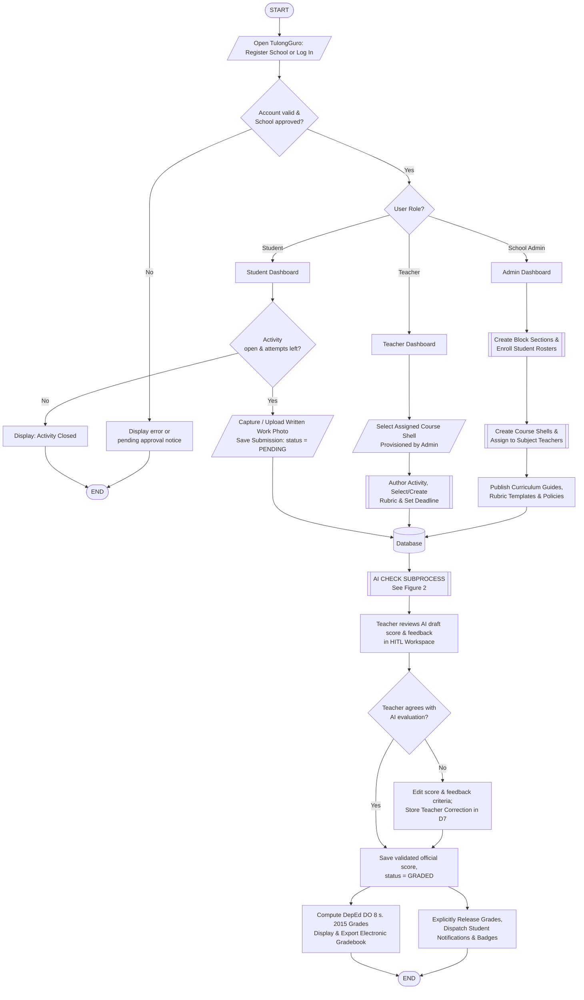
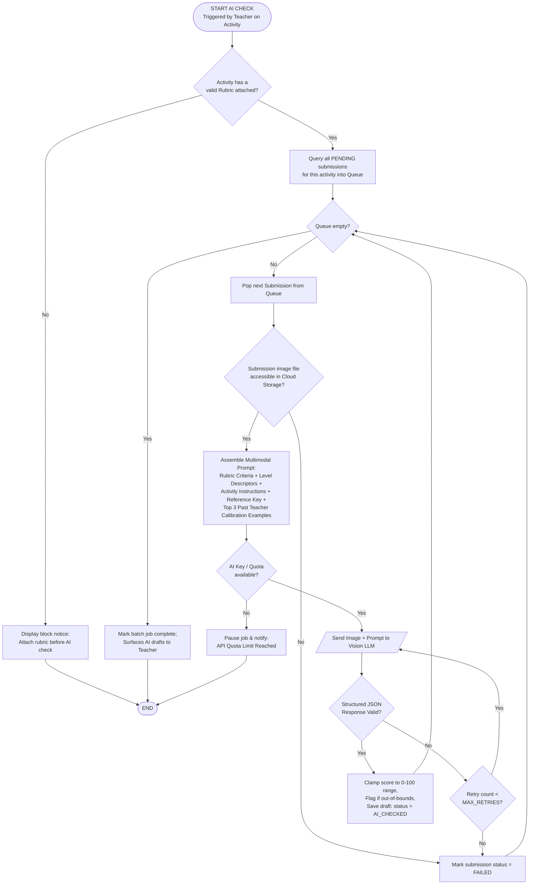

# TulongGuro — System Flowchart and Pseudocode

For inclusion in Chapter 3 (Methodology / System Design) and the Appendix.

---

## 1. System Flowcharts

### Figure 1. System Flowchart (Overall End-to-End System)



---

### Plain-Text ANSI Flowchart (For Word, Visio, or draw.io)

```
                                  ( START )
                                      |
                      [/ Open TulongGuro: Register or Log In /]
                                      |
                      < Account valid & School approved? > --No--> [Error / Pending Notice] --> ( END )
                                      |Yes
                                < User Role? >
              /                       |                       \
      [ School Admin ]           [ Teacher ]              [ Student ]
             |                        |                        |
   [Create Block Sections]    [/Select Assigned Shell/]  < Activity Open? > --No--> [Closed] --> ( END )
             |                        |                        |Yes
   [Enroll Student Rosters]   [Build Activity + Rubric]  [/ Capture & Submit Photo (PENDING) /]
             |                        |                        |
   [Create Course Shells &            |                        |
    Assign to Teachers]               |                        |
             \                        |                       /
              +-----------------> ((DATABASE)) <-------------+
                                      |
                         [[ AI CHECK SUBPROCESS ]]
                                      |
                      [Teacher Reviews AI Draft in HITL]
                                      |
                      < Teacher Agrees with AI Score? > --No--> [Edit Score & Feedback;
                                      |Yes                       Save Calibration Example]
                                      |                                    |
                      [Save Validated Grade (GRADED)] <--------------------+
                                      |
                      +---------------+---------------+
                      |                               |
          [Release Results to Students,    [Compute DepEd DO 8 s. 2015
           Dispatch Notifications/Badges]   Transmuted Gradebook & Export]
                      |                               |
                      +-----------> ( END ) <---------+
```

---

### Figure 2. AI-Assisted Grading Subprocess (Human-in-the-Loop)



---

## 2. Modular Pseudocode

### Module 1 — Main System Entry & Dispatcher

```
BEGIN TulongGuro
    DISPLAY "TulongGuro: AI-Assisted Classroom Management & Grading"
    
    IF user is not registered THEN
        CALL RegisterSchool()
    END IF

    sessionUser <- CALL Authenticate()
    IF sessionUser IS NULL THEN
        EXIT PROGRAM
    END IF

    CASE sessionUser.role OF
        "ADMIN":
            CALL AdminWorkflow(sessionUser)
        "TEACHER":
            CALL TeacherWorkflow(sessionUser)
        "STUDENT":
            CALL StudentWorkflow(sessionUser)
        OTHERWISE:
            DISPLAY "Unauthorized role"
    END CASE
END
```

---

### Module 2 — Authentication & Access Control

```
FUNCTION Authenticate()
    INPUT username, password
    
    userRecord <- SELECT * FROM User WHERE username = username
    IF userRecord IS NULL THEN
        DISPLAY "Error: Invalid username or password."
        RETURN NULL
    END IF

    IF NOT VerifyPasswordHash(password, userRecord.passwordHash) THEN
        DISPLAY "Error: Invalid username or password."
        RETURN NULL
    END IF

    schoolRecord <- SELECT * FROM School WHERE id = userRecord.schoolId
    IF schoolRecord.status <> "APPROVED" THEN
        DISPLAY "Notice: School registration is pending Platform Admin verification."
        RETURN NULL
    END IF

    token <- GenerateJWT(userRecord.id, userRecord.role, schoolRecord.id)
    RETURN { user: userRecord, school: schoolRecord, token: token }
END FUNCTION
```

---

### Module 3 — School Administrator Management (Sections, Rosters & Course Shells)

```
// ============================================================================
// ONLY the School Administrator creates block sections, enrolls rosters,
// and creates course shells, assigning them directly to subject teachers.
// ============================================================================

PROCEDURE AdminCreateSection(admin, sectionName, gradeLevel, schoolYear, adviserTeacherId)
    // 1. Validate administrative authority within school tenant
    IF admin.role <> "ADMIN" THEN
        DISPLAY "Access Denied: Administrative privileges required."
        RETURN
    END IF

    // 2. Prevent duplicate section names in the same academic school year
    existingSection <- SELECT * FROM Section 
                        WHERE schoolId   = admin.schoolId 
                          AND schoolYear = schoolYear 
                          AND LOWER(name)= LOWER(sectionName)
    IF existingSection IS NOT NULL THEN
        DISPLAY "Error: Section name already exists for this school year."
        RETURN
    END IF

    // 3. Verify that the nominated adviser belongs to this school
    adviser <- SELECT * FROM User WHERE id = adviserTeacherId AND schoolId = admin.schoolId
    IF adviser IS NULL THEN
        DISPLAY "Error: Designated adviser does not exist in your school."
        RETURN
    END IF

    // 4. Create Section record
    newSection <- INSERT INTO Section (name = sectionName, gradeLevel = gradeLevel,
                                       schoolYear = schoolYear, adviserId = adviser.id,
                                       schoolId = admin.schoolId)
    DISPLAY "Section created successfully: " + newSection.name
    RETURN newSection
END PROCEDURE


PROCEDURE AdminEnrollRoster(admin, sectionId, studentList)
    section <- SELECT * FROM Section WHERE id = sectionId AND schoolId = admin.schoolId
    IF section IS NULL THEN RETURN END IF

    generatedCredentials <- []

    FOR EACH studentData IN studentList DO
        // Generate uniform institutional username: <SCHOOL_PREFIX>-<YY>-<SEQ>
        username <- GenerateSchoolScopedStudentId(admin.schoolId, section.schoolYear)
        tempPassword <- GenerateSecureRandomPassword()
        passwordHash <- HashPassword(tempPassword)

        newStudent <- INSERT INTO User (username = username, passwordHash = passwordHash,
                                        fullName = studentData.fullName, lrn = studentData.lrn,
                                        birthDate = studentData.birthDate, role = "STUDENT",
                                        schoolId = admin.schoolId, sectionId = section.id)

        APPEND { studentName: studentData.fullName, username: username, temporaryPassword: tempPassword } 
            TO generatedCredentials
    END FOR

    // Surface one-time exportable credential sheet for distribution to learners
    DISPLAY generatedCredentials
END PROCEDURE


PROCEDURE AdminCreateCourseShellAndAssign(admin, subject, gradeLevel, schoolYear, sectionId, teacherId, curriculumId)
    // 1. Verify administrative access and school tenancy
    section <- SELECT * FROM Section WHERE id = sectionId AND schoolId = admin.schoolId
    teacher <- SELECT * FROM User WHERE id = teacherId AND schoolId = admin.schoolId AND role = "TEACHER"
    
    IF section IS NULL OR teacher IS NULL THEN
        DISPLAY "Error: Invalid section or teacher selection."
        RETURN
    END IF

    // 2. Prevent duplicate course shell for the same subject, grade, section, and teacher
    duplicateShell <- SELECT * FROM Class 
                       WHERE teacherId  = teacher.id 
                         AND sectionId  = section.id 
                         AND schoolYear = schoolYear 
                         AND subject    = subject
    IF duplicateShell IS NOT NULL THEN
        DISPLAY "Error: Teacher already holds this course shell for the specified section."
        RETURN
    END IF

    className <- subject + " — " + gradeLevel + " (" + section.name + ")"

    // 3. Create the Course Shell (Class) and directly assign it to the Subject Teacher
    courseShell <- INSERT INTO Class (name = className, subject = subject, 
                                      gradeLevel = gradeLevel, schoolYear = schoolYear,
                                      sectionId = section.id, teacherId = teacher.id,
                                      schoolId = admin.schoolId)

    // 4. Optionally link school curriculum and ingest published lesson templates
    IF curriculumId IS NOT NULL THEN
        curriculum <- SELECT * FROM Curriculum WHERE id = curriculumId AND schoolId = admin.schoolId
        IF curriculum IS NOT NULL THEN
            lessons <- SELECT * FROM CurriculumLesson WHERE curriculumId = curriculum.id
            FOR EACH lesson IN lessons DO
                INSERT INTO ClassLesson (classId = courseShell.id, title = lesson.title,
                                        description = lesson.description, weekNumber = lesson.weekNumber,
                                        outputType = lesson.outputType, competencies = lesson.competencies,
                                        rubricTemplateId = lesson.rubricTemplateId)
            END FOR
        END IF
    END IF

    DISPLAY "Course shell successfully provisioned and assigned to " + teacher.fullName
    RETURN courseShell
END PROCEDURE


PROCEDURE AdminReassignCourseShell(admin, courseShellId, newTeacherId)
    courseShell <- SELECT * FROM Class WHERE id = courseShellId AND schoolId = admin.schoolId
    newTeacher  <- SELECT * FROM User WHERE id = newTeacherId AND schoolId = admin.schoolId AND role = "TEACHER"
    
    IF courseShell IS NULL OR newTeacher IS NULL THEN
        DISPLAY "Error: Target course shell or teacher not found."
        RETURN
    END IF

    // Reassignment transfers ownership; all student submissions, activities, and grades persist
    UPDATE Class SET teacherId = newTeacher.id WHERE id = courseShell.id
    DISPLAY "Course shell " + courseShell.name + " reassigned to " + newTeacher.fullName
END PROCEDURE
```

---

### Module 4 — Teacher Activity Creation & Classroom Management

```
// ============================================================================
// Teachers work strictly inside their ASSIGNED course shells.
// Teachers do NOT create sections or shells; they author activities & rubrics.
// ============================================================================

PROCEDURE TeacherWorkflow(teacher)
    // 1. Fetch all course shells assigned to this teacher by the School Administrator
    assignedClasses <- SELECT * FROM Class WHERE teacherId = teacher.id AND schoolId = teacher.schoolId
    
    IF assignedClasses IS EMPTY THEN
        DISPLAY "Notice: No course shells assigned yet. Contact your School Administrator."
        RETURN
    END IF

    selectedClass <- DISPLAY_AND_SELECT(assignedClasses)
    CALL TeacherClassDashboard(teacher, selectedClass)
END PROCEDURE


PROCEDURE TeacherCreateActivity(teacher, classId)
    courseShell <- SELECT * FROM Class WHERE id = classId AND teacherId = teacher.id
    IF courseShell IS NULL THEN RETURN END IF

    INPUT title, instructions, componentType, maxScore, deadlineDate, referenceFiles
    // componentType MUST be one of: "WRITTEN_WORK", "PERFORMANCE_TASK", "QUARTERLY_ASSESSMENT"

    // Rubric Selection / Authoring: School template, Custom criteria, or Existing
    INPUT rubricChoice
    IF rubricChoice.mode == "TEMPLATE" THEN
        rubricCriteria <- SELECT criteria FROM RubricTemplate WHERE id = rubricChoice.templateId
    ELSE
        rubricCriteria <- rubricChoice.customCriteria  // User-defined criteria with sum of weights = 100%
    END IF

    IF rubricCriteria IS EMPTY THEN
        DISPLAY "Error: An assessment rubric is mandatory to create an activity."
        RETURN
    END IF

    newActivity <- INSERT INTO Activity (classId = courseShell.id, title = title,
                                         instructions = instructions, componentType = componentType,
                                         maxScore = maxScore, deadline = deadlineDate,
                                         rubric = rubricCriteria, referenceFiles = referenceFiles)

    DISPLAY "Activity published to section: " + newActivity.title
END PROCEDURE
```

---

### Module 5 — Student Submission Processing

```
PROCEDURE StudentSubmitWork(student, activityId)
    activity <- SELECT * FROM Activity WHERE id = activityId
    
    // 1. Validate submission deadline (Manila boundary: 23:59:59 PHT)
    IF CurrentDateTimeManila() > activity.deadline AND NOT activity.allowLate THEN
        DISPLAY "Submission rejected: Deadline has passed."
        RETURN
    END IF

    // 2. Check attempt limits
    existing <- SELECT * FROM Submission WHERE studentId = student.id AND activityId = activity.id
    IF existing IS NOT NULL AND existing.attemptCount >= activity.maxAttempts THEN
        DISPLAY "Submission rejected: Maximum attempt limit reached."
        RETURN
    END IF

    // 3. Ingest handwritten artifact (Camera capture or Image file)
    INPUT imageFiles
    mergedImage <- CombineAndOptimizePages(imageFiles)
    imageUrl    <- UploadToCloudStorage(mergedImage, bucket = "submissions")

    IF existing IS NOT NULL THEN
        UPDATE Submission SET imageUrl = imageUrl, status = "PENDING",
                              attemptCount = attemptCount + 1, submittedAt = CurrentDateTime()
                          WHERE id = existing.id
    ELSE
        INSERT INTO Submission (studentId = student.id, activityId = activity.id,
                                imageUrl = imageUrl, attemptCount = 1,
                                status = "PENDING", submittedAt = CurrentDateTime())
    END IF

    DISPLAY "Work submitted successfully. Status: PENDING teacher evaluation."
END PROCEDURE
```

---

### Module 6 — AI-Assisted Vision Grading Engine

```
PROCEDURE RunAiCheck(teacher, activityId)
    activity <- SELECT * FROM Activity WHERE id = activityId
    courseShell <- SELECT * FROM Class WHERE id = activity.classId AND teacherId = teacher.id

    IF activity.rubric IS EMPTY THEN
        DISPLAY "Error: Cannot run AI check without an attached rubric."
        RETURN
    END IF

    // 1. Gather all pending submissions
    pendingSubmissions <- SELECT * FROM Submission 
                           WHERE activityId = activity.id 
                             AND status IN ("PENDING", "FAILED")

    IF pendingSubmissions IS EMPTY THEN
        DISPLAY "No pending submissions to grade."
        RETURN
    END IF

    // 2. Retrieve top 3 past teacher calibration pairs for few-shot prompt injection
    calibrationExamples <- SELECT TOP 3 * FROM GradingExample
                            WHERE teacherId    = teacher.id
                              AND activityType = activity.componentType
                              AND gradeLevel   = courseShell.gradeLevel
                            ORDER BY createdAt DESC

    // 3. Process each submission in batch queue
    FOR EACH submission IN pendingSubmissions DO
        submissionImage <- FetchImageFromStorage(submission.imageUrl)
        IF submissionImage IS NULL THEN
            UPDATE Submission SET status = "FAILED" WHERE id = submission.id
            CONTINUE
        END IF

        // Assemble multimodal grading prompt
        prompt <- BuildPrompt(
            instructions   = activity.instructions,
            rubricCriteria = activity.rubric,
            referenceKey   = activity.referenceFiles,
            fewShotExamples= calibrationExamples
        )

        attempts <- 0
        aiResponse <- NULL

        REPEAT
            aiResponse <- InvokeVisionLanguageModel(submissionImage, prompt)
            attempts <- attempts + 1
        UNTIL (aiResponse IS VALID JSON) OR (attempts >= 3)

        IF aiResponse IS NULL OR NOT (aiResponse IS VALID JSON) THEN
            UPDATE Submission SET status = "FAILED" WHERE id = submission.id
            CONTINUE
        END IF

        // Clamp draft score to valid range [0, 100]
        draftScore <- Clamp(aiResponse.totalScore, 0, 100)
        isOutOfRange <- (aiResponse.totalScore < 0 OR aiResponse.totalScore > 100)

        // Store as DRAFT evaluation (AI_CHECKED); does NOT count as official grade
        UPDATE Submission SET 
            aiScore          = draftScore,
            aiFeedback       = aiResponse.overallFeedback,
            aiCriteriaScores = aiResponse.criteriaBreakdown,
            scoreOutOfRange  = isOutOfRange,
            status           = "AI_CHECKED"
        WHERE id = submission.id

        LOG AiRequestLog(teacher.id, activity.id, tokens = aiResponse.tokensUsed)
    END FOR

    DISPLAY "AI grading completed. Drafts ready for Human-in-the-Loop review."
END PROCEDURE
```

---

### Module 7 — Human-in-the-Loop (HITL) Validation & Grade Release

```
PROCEDURE TeacherValidateSubmission(teacher, submissionId, finalScore, finalFeedback, criteriaScores)
    submission <- SELECT * FROM Submission WHERE id = submissionId
    
    // Validate score bounds
    IF finalScore < 0 OR finalScore > 100 THEN
        DISPLAY "Error: Score must be between 0 and 100."
        RETURN
    END IF

    // Calibration Capture: If teacher adjusted AI draft, record correction pair for future prompt adaptation
    IF finalScore <> submission.aiScore OR finalFeedback <> submission.aiFeedback THEN
        INSERT INTO GradingExample (
            teacherId       = teacher.id,
            activityType    = submission.activity.componentType,
            gradeLevel      = submission.activity.class.gradeLevel,
            aiScore         = submission.aiScore,
            aiFeedback      = submission.aiFeedback,
            teacherScore    = finalScore,
            teacherFeedback = finalFeedback
        )
    END IF

    // Write official validated grade record
    UPDATE Submission SET
        hitlScore        = finalScore,
        hitlFeedback     = finalFeedback,
        hitlCriteria     = criteriaScores,
        status           = "GRADED",
        validatedAt      = CurrentDateTime()
    WHERE id = submission.id

    LOG GradingAuditLog(teacherId = teacher.id, submissionId = submission.id, score = finalScore)
    DISPLAY "Grade successfully validated."
END PROCEDURE


PROCEDURE TeacherReleaseGrades(teacher, activityId)
    // Deliberate release step: makes validated grades visible to students
    gradedSubmissions <- SELECT * FROM Submission 
                          WHERE activityId = activityId 
                            AND status = "GRADED" 
                            AND releasedAt IS NULL

    FOR EACH submission IN gradedSubmissions DO
        UPDATE Submission SET releasedAt = CurrentDateTime() WHERE id = submission.id
        
        // Dispatch student notification & evaluate competency badge triggers
        CALL SendNotification(submission.studentId, "Your grade for " + submission.activity.title + " has been released.")
        CALL EvaluateAndAwardBadges(submission.studentId, submission.hitlScore)
    END FOR

    DISPLAY "Grades released to section roster."
END PROCEDURE
```

---

### Module 8 — DepEd Order No. 8, s. 2015 Grading Engine

```
FUNCTION ComputeQuarterlyGrade(studentId, classId)
    courseShell <- SELECT * FROM Class WHERE id = classId
    policy      <- SELECT * FROM GradingPolicy WHERE schoolId = courseShell.schoolId AND subject = courseShell.subject
    
    // Standard DepEd Weights (e.g., Languages: WW=30%, PT=50%, QA=20%)
    weights <- { WW: policy.weightWW, PT: policy.weightPT, QA: policy.weightQA }

    components <- ["WRITTEN_WORK", "PERFORMANCE_TASK", "QUARTERLY_ASSESSMENT"]
    weightedSum <- 0
    activeWeightTotal <- 0

    FOR EACH comp IN components DO
        submissions <- SELECT * FROM Submission s
                       JOIN Activity a ON s.activityId = a.id
                       WHERE s.studentId = studentId 
                         AND a.classId = classId 
                         AND a.componentType = comp
                         AND s.status = "GRADED"
                         AND s.releasedAt IS NOT NULL
                         AND s.excusedAt IS NULL      // Excused submissions are excluded from denominator

        totalEarned   <- SUM(submissions.hitlScore)
        totalPossible <- SUM(submissions.activity.maxScore)

        IF totalPossible > 0 THEN
            componentPercentage <- (totalEarned / totalPossible) * 100
            weightedSum <- weightedSum + (componentPercentage * weights[comp])
            activeWeightTotal <- activeWeightTotal + weights[comp]
        END IF
    END FOR

    IF activeWeightTotal == 0 THEN
        RETURN { initialGrade: NULL, finalGrade: NULL, remarks: "No Released Grades" }
    END IF

    // Redistribute weight across components with graded activities
    initialGrade <- (weightedSum / activeWeightTotal)

    // DepEd DO 8 s. 2015 Transmutation Function
    IF policy.useTransmutation THEN
        IF initialGrade >= 60.0 THEN
            transmutedGrade <- 75.0 + FLOOR((initialGrade - 60.0) / 1.6)
        ELSE
            transmutedGrade <- 60.0 + FLOOR(initialGrade / 4.0)
        END IF
        finalGrade <- Clamp(transmutedGrade, 60.0, 100.0)
    ELSE
        finalGrade <- Round(initialGrade, 2)
    END IF

    // Descriptor ladder
    IF finalGrade >= 90.0 THEN descriptor <- "Outstanding"
    ELSE IF finalGrade >= 85.0 THEN descriptor <- "Very Satisfactory"
    ELSE IF finalGrade >= 80.0 THEN descriptor <- "Satisfactory"
    ELSE IF finalGrade >= 75.0 THEN descriptor <- "Fairly Satisfactory"
    ELSE descriptor <- "Did Not Meet Expectations"

    remarks <- (finalGrade >= 75.0) ? "Passed" : "Failed"

    RETURN {
        initialGrade: Round(initialGrade, 2),
        finalGrade:   finalGrade,
        descriptor:   descriptor,
        remarks:      remarks
    }
END FUNCTION
```

---

## 3. Methodological Design Summary

1. **Administrative Centralization of Institutional Scaffolding:**
   The school structure (block sections, enrolled rosters, curriculum lessons, and course shells) is strictly created and managed by the **School Administrator**. Teachers are assigned course shells corresponding to their designated teaching loads, preventing section desynchronization and orphaned learner accounts.

2. **Strict Human-in-the-Loop (HITL) Integrity:**
   AI never writes official grades of record. The VLM outputs structured draft proposals (`status = AI_CHECKED`), which must be reviewed, potentially overridden, and explicitly committed (`status = GRADED`) by the subject teacher before being deliberately released (`releasedAt`) to the learner.

3. **Dynamic Few-Shot Teacher Calibration:**
   When teachers override AI draft scores, the system records the pre- and post-adjustment evaluation as a `GradingExample`. The 3 most recent examples matching the teacher, subject, and grade level are dynamically injected into subsequent VLM prompts, aligning AI evaluations with each teacher's individual grading nuance.

4. **Compliant DepEd DO 8 s. 2015 Grading:**
   Assessment scores are aggregated by component (Written Work, Performance Tasks, Quarterly Assessment), normalized with excused activity handling, and transmuted into report card grades following the official Department of Education grading scale.
