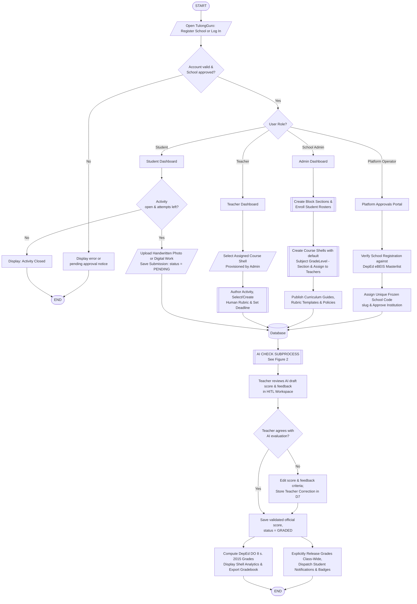
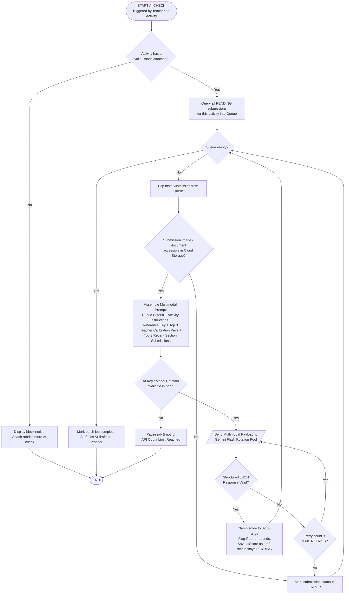
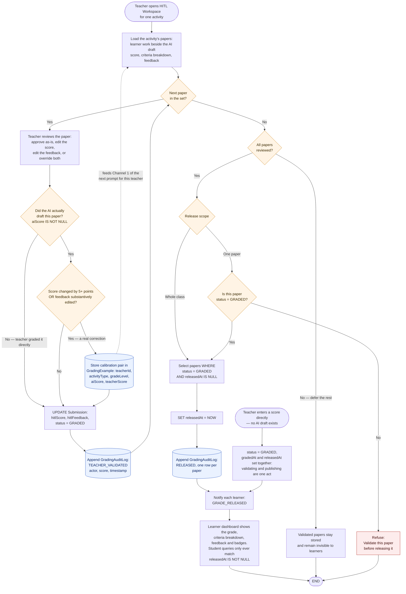

# TulongGuro — System Flowchart and Pseudocode

For inclusion in Chapter 3 (Methodology / System Design) and the Appendix.

---

## 1. System Flowcharts

### Figure 1. System Flowchart (Overall End-to-End System)



---

### Plain-Text ANSI Flowchart (For Word, Visio, or draw.io)

```
                                  ( START )
                                      |
                      [/ Open TulongGuro: Register or Log In /]
                                      |
                      < Account valid & School approved? > --No--> [Error / Pending Notice] --> ( END )
                                      |Yes
                                < User Role? >
              /             |                  |                       \
     [Platform Operator] [School Admin]    [ Teacher ]             [ Student ]
             |              |                  |                        |
   [Verify DepEd eBEIS  [Create Block     [/Select Assigned Shell/] < Activity Open? > --No--> [Closed] --> (END)
    Masterlist ID]       Sections]             |                        |Yes
             |              |             [Build Activity + Rubric] [/ Upload Photo / Digital Work (PENDING) /]
   [Assign School Slug  [Enroll Rosters]       |                        |
    & Approve School]       |                  |                        |
             |          [Create Course         |                        |
             \           Shells & Assign]      |                        |
              \             |                  |                       /
               +------------+-------------> ((DATABASE)) <-------------+
                                               |
                                  [[ AI CHECK SUBPROCESS ]]
                                               |
                               [Teacher Reviews AI Draft in HITL]
                                               |
                               < Teacher Agrees with AI Score? > --No--> [Edit Score & Feedback;
                                               |Yes                       Save Calibration Example]
                                               |                                    |
                               [Save Validated Grade (GRADED)] <--------------------+
                                               |
                               +---------------+---------------+
                               |                               |
                   [Release Results Class-Wide,     [Compute DepEd DO 8 s. 2015
                    Dispatch Notifications/Badges]   Transmuted Gradebook & Export]
                               |                               |
                               +-----------> ( END ) <---------+
```

---

### Figure 2. AI-Assisted Grading Subprocess (Human-in-the-Loop)



---

### Figure 5. Human-in-the-Loop Validation and Class-Wide Release



---

## 2. Modular Pseudocode

### Module 1 — Main System Entry & Role Routing

```
BEGIN TulongGuro
    DISPLAY "TulongGuro: AI-Assisted Classroom Management & Grading"
    
    IF user is not registered THEN
        CALL RegisterSchool()
    END IF

    sessionUser <- CALL Authenticate()
    IF sessionUser IS NULL THEN
        EXIT PROGRAM
    END IF

    CASE sessionUser.role OF
        "PLATFORM":
            CALL PlatformOperatorWorkflow(sessionUser)
        "ADMIN":
            CALL AdminWorkflow(sessionUser)
        "TEACHER":
            CALL TeacherWorkflow(sessionUser)
        "STUDENT":
            CALL StudentWorkflow(sessionUser)
        OTHERWISE:
            DISPLAY "Unauthorized role"
    END CASE
END
```

---

### Module 2 — Authentication, School Slugs & Tenant Isolation

```
FUNCTION Authenticate()
    INPUT identifier, password   // identifier = username OR school-scoped domain email
    
    userRecord <- SELECT * FROM User WHERE (username = identifier OR email = identifier)
    IF userRecord IS NULL OR NOT VerifyPasswordHash(password, userRecord.passwordHash) THEN
        DISPLAY "Error: Invalid credentials."
        RETURN NULL
    END IF

    // Platform Operators carry no schoolId
    IF userRecord.role == "PLATFORM" THEN
        token <- GenerateJWT(userRecord.id, "PLATFORM", NULL)
        RETURN { user: userRecord, token: token }
    END IF

    schoolRecord <- SELECT * FROM School WHERE id = userRecord.schoolId
    IF schoolRecord.status <> "APPROVED" THEN
        DISPLAY "Notice: School registration is pending Platform Operator verification."
        RETURN NULL
    END IF

    token <- GenerateJWT(userRecord.id, userRecord.role, schoolRecord.id, schoolRecord.slug)
    RETURN { user: userRecord, school: schoolRecord, token: token }
END FUNCTION


PROCEDURE PlatformApproveSchool(platformOperator, schoolId, assignedSlug)
    IF platformOperator.role <> "PLATFORM" THEN RETURN END IF

    school <- SELECT * FROM School WHERE id = schoolId
    // Verify against official DepEd eBEIS registry
    isValidDepEd <- CheckDepEdMasterlist(school.depedSchoolId)
    IF NOT isValidDepEd THEN
        DISPLAY "Warning: DepEd School ID not found in eBEIS masterlist."
    END IF

    UPDATE School SET status = "APPROVED", slug = assignedSlug, approvedAt = CurrentDateTime() 
    WHERE id = schoolId

    DISPLAY "School approved with institutional slug: " + assignedSlug
END PROCEDURE
```

---

### Module 3 — School Administrator Management (Sections, Rosters & Course Shells)

```
PROCEDURE AdminCreateSection(admin, sectionName, gradeLevel, schoolYear, adviserTeacherId)
    existingSection <- SELECT * FROM Section 
                        WHERE schoolId   = admin.schoolId 
                          AND schoolYear = schoolYear 
                          AND LOWER(name)= LOWER(sectionName)
    IF existingSection IS NOT NULL THEN
        DISPLAY "Error: Section name already exists for this school year."
        RETURN
    END IF

    adviser <- SELECT * FROM User WHERE id = adviserTeacherId AND schoolId = admin.schoolId
    newSection <- INSERT INTO Section (name = sectionName, gradeLevel = gradeLevel,
                                       schoolYear = schoolYear, adviserId = adviser.id,
                                       schoolId = admin.schoolId)
    RETURN newSection
END PROCEDURE


PROCEDURE AdminEnrollRoster(admin, sectionId, studentList)
    school  <- SELECT * FROM School WHERE id = admin.schoolId
    section <- SELECT * FROM Section WHERE id = sectionId AND schoolId = admin.schoolId
    generatedCredentials <- []

    FOR EACH studentData IN studentList DO
        // Generate uniform institutional username prefixed by frozen school slug: <SLUG>-<YY>-<SEQ>
        username <- GenerateSlugPrefixedStudentId(school.slug, section.schoolYear)
        tempPassword <- GenerateBirthdayOrSecurePassword(studentData.birthDate)
        passwordHash <- HashPassword(tempPassword)

        newStudent <- INSERT INTO User (username = username, passwordHash = passwordHash,
                                        fullName = studentData.fullName, lrn = studentData.lrn,
                                        birthDate = studentData.birthDate, role = "STUDENT",
                                        schoolId = admin.schoolId, sectionId = section.id)

        APPEND { studentName: studentData.fullName, username: username, temporaryPassword: tempPassword } 
            TO generatedCredentials
    END FOR

    DISPLAY generatedCredentials
END PROCEDURE


PROCEDURE AdminCreateCourseShellAndAssign(admin, subject, gradeLevel, schoolYear, sectionId, teacherId, curriculumId)
    section <- SELECT * FROM Section WHERE id = sectionId AND schoolId = admin.schoolId
    teacher <- SELECT * FROM User WHERE id = teacherId AND schoolId = admin.schoolId AND role = "TEACHER"
    
    // Default name pattern: "Subject GradeLevel - Section" (e.g. "English Grade 6 - Newton")
    bareSectionName <- RemoveGradePrefix(section.name)
    className <- subject + " — " + bareSectionName

    courseShell <- INSERT INTO Class (name = className, subject = subject, 
                                      gradeLevel = gradeLevel, schoolYear = schoolYear,
                                      sectionId = section.id, teacherId = teacher.id,
                                      schoolId = admin.schoolId)

    IF curriculumId IS NOT NULL THEN
        curriculum <- SELECT * FROM Curriculum WHERE id = curriculumId AND schoolId = admin.schoolId
        IF curriculum IS NOT NULL THEN
            lessons <- SELECT * FROM CurriculumLesson WHERE curriculumId = curriculum.id
            FOR EACH lesson IN lessons DO
                INSERT INTO ClassLesson (classId = courseShell.id, title = lesson.title,
                                        outputType = lesson.outputType, competencies = lesson.competencies)
            END FOR
        END IF
    END IF

    DISPLAY "Course shell provisioned and assigned to " + teacher.fullName
    RETURN courseShell
END PROCEDURE
```

---

### Module 4 — Teacher Activity Creation & Classroom Management

```
PROCEDURE TeacherWorkflow(teacher)
    // Teachers access shells assigned by the Administrator
    assignedClasses <- SELECT * FROM Class WHERE teacherId = teacher.id AND schoolId = teacher.schoolId
    selectedClass   <- DISPLAY_AND_SELECT(assignedClasses)
    CALL TeacherClassDashboard(teacher, selectedClass)
END PROCEDURE


PROCEDURE TeacherCreateActivity(teacher, classId)
    courseShell <- SELECT * FROM Class WHERE id = classId AND teacherId = teacher.id
    INPUT title, instructions, type, component, points, deadlineDate, lateUntilDate, referenceFiles

    // Human-Authored Rubric Selection (School Template, Custom Criteria, or Uploaded Doc)
    INPUT rubricChoice
    IF rubricChoice.mode == "TEMPLATE" THEN
        rubricCriteria <- SELECT criteria FROM RubricTemplate WHERE id = rubricChoice.templateId
    ELSE IF rubricChoice.mode == "UPLOAD" THEN
        // AI parses human document into editable table without inventing criteria
        rubricCriteria <- ParseRubricDocument(rubricChoice.file)
    ELSE
        rubricCriteria <- rubricChoice.customCriteria  // User-defined criteria summing to 100%
    END IF

    IF rubricCriteria IS EMPTY THEN
        DISPLAY "Error: A valid rubric is required before creating an activity."
        RETURN
    END IF

    // `type` is the kind of task (Essay, Reflection, Short Response) and drives
    // few-shot retrieval in Module 6; `component` is the DepEd grading bucket
    // (WW, PT, QA) and drives the weighting in Module 8. They are separate columns.
    // A lateUntil that is not strictly after the deadline is not a late window at
    // all — a date-only deadline already runs to the end of its day — so it is
    // discarded rather than stored.
    IF lateUntilDate <= deadlineDate THEN lateUntilDate <- NULL END IF

    newActivity <- INSERT INTO Activity (classId = courseShell.id, title = title,
                                         instructions = instructions, type = type,
                                         component = component, points = points,
                                         deadline = deadlineDate, lateUntil = lateUntilDate,
                                         rubric = rubricCriteria, referenceFiles = referenceFiles)
END PROCEDURE
```

---

### Module 5 — Student Submission Ingestion (Multimodal)

```
PROCEDURE StudentSubmitWork(student, activityId)
    activity <- SELECT * FROM Activity WHERE id = activityId
    
    // Check the submission window & attempt limits.
    // A date-only deadline means the END of that day in Manila (23:59:59.999 PHT).
    // activity.lateUntil is a DATE, not a flag: when set and strictly after the
    // deadline it is the date the activity actually closes; otherwise the
    // deadline itself closes it.
    closesOn <- (activity.lateUntil > activity.deadline) ? activity.lateUntil : activity.deadline
    IF CurrentDateTimeManila() > EndOfDayManila(closesOn) THEN
        DISPLAY "Submission rejected: Activity is closed."; RETURN
    END IF

    // Ingest handwritten photo captures (PNG/JPEG) or digital files (PDF/DOCX)
    INPUT uploadedFiles
    processedArtifact <- PreprocessAndOptimizeSubmission(uploadedFiles)
    fileUrl <- UploadToCloudStorage(processedArtifact)

    INSERT/UPDATE Submission (studentId = student.id, activityId = activity.id,
                              imageUrl = fileUrl, status = "PENDING", submittedAt = CurrentDateTime())
    DISPLAY "Work submitted successfully. Status: PENDING."
END PROCEDURE
```

---

### Module 6 — AI-Assisted Checking & Adaptive In-Context Calibration

```
PROCEDURE RunAiCheck(teacher, activityId)
    activity    <- SELECT * FROM Activity WHERE id = activityId
    courseShell <- SELECT * FROM Class WHERE id = activity.classId AND teacherId = teacher.id

    IF activity.rubric IS EMPTY THEN
        DISPLAY "Error: Cannot run AI check without an attached rubric."; RETURN
    END IF

    pendingSubmissions <- SELECT * FROM Submission WHERE activityId = activity.id AND status IN ("PENDING", "ERROR")
    
    // Channel 1: Top 3 past teacher correction pairs
    calibrationExamples <- SELECT TOP 3 * FROM GradingExample
                            WHERE teacherId    = teacher.id
                              AND activityType = activity.type
                              AND gradeLevel   = courseShell.gradeLevel
                            ORDER BY createdAt DESC

    // Channel 2: Top 3 recent teacher-approved submissions from the same section (Section Memory)
    sectionMemory <- SELECT TOP 3 hitlScore, hitlFeedback FROM Submission
                      WHERE activity.class.sectionId = courseShell.sectionId AND status = "GRADED"
                      ORDER BY updatedAt DESC

    FOR EACH submission IN pendingSubmissions DO
        submissionFile <- FetchArtifactFromStorage(submission.imageUrl)
        prompt <- AssembleMultimodalPrompt(activity.instructions, activity.rubric, 
                                           activity.referenceFiles, calibrationExamples, sectionMemory)

        // Invoke rotated Gemini Flash model pool
        aiResponse <- InvokeModelPoolWithFallback(submissionFile, prompt)

        IF aiResponse IS VALID JSON THEN
            draftScore <- Clamp(aiResponse.totalScore, 0, 100)
            UPDATE Submission SET 
                aiScore          = draftScore,
                aiFeedback       = aiResponse.overallFeedback,
                aiCriteriaScores = aiResponse.criteriaBreakdown
                // status deliberately stays "PENDING": the draft is identified by
                // aiScore being set, and only teacher validation moves it to "GRADED".
            WHERE id = submission.id
        ELSE
            UPDATE Submission SET status = "ERROR" WHERE id = submission.id
        END IF
    END FOR
END PROCEDURE
```

---

### Module 7 — Human-in-the-Loop Validation & Class-Wide Release

```
PROCEDURE TeacherValidateSubmission(teacher, submissionId, finalScore, finalFeedback)
    submission <- SELECT * FROM Submission WHERE id = submissionId
    
    // Record a correction pair only if the AI actually produced a draft for this
    // paper. Without this guard, a paper graded straight from the review screen
    // (or after the daily AI quota ran out) has aiScore = NULL, and the delta
    // against it equals the whole grade — storing a correction that never
    // happened and teaching the model its own scores run catastrophically low.
    IF submission.aiScore IS NOT NULL THEN
        // >= 5 points, or a substantive edit to the feedback text (whitespace
        // and formatting-only changes do not count).
        IF ABS(finalScore - submission.aiScore) >= 5
           OR FeedbackSubstantivelyChanged(finalFeedback, submission.aiFeedback) THEN
            INSERT INTO GradingExample (teacherId = teacher.id, activityType = submission.activity.type,
                                        gradeLevel = submission.activity.class.gradeLevel,
                                        aiScore = ROUND(submission.aiScore), aiFeedback = submission.aiFeedback,
                                        teacherScore = ROUND(finalScore), teacherFeedback = finalFeedback)
        END IF
    END IF

    UPDATE Submission SET hitlScore = finalScore, hitlFeedback = finalFeedback,
                          status = "GRADED"
                      WHERE id = submission.id

    LOG GradingAuditLog(teacherId = teacher.id, submissionId = submission.id, score = finalScore)
END PROCEDURE


PROCEDURE TeacherReleaseGrades(teacher, activityId)
    // Deliberate class-wide batch release
    FOR EACH submission IN (SELECT * FROM Submission WHERE activityId = activityId AND status = "GRADED") DO
        UPDATE Submission SET releasedAt = CurrentDateTime() WHERE id = submission.id
        CALL SendNotification(submission.studentId, "Your grades for " + submission.activity.title + " are now available.")
        CALL AwardBadges(submission.studentId, submission.hitlScore)
    END FOR
END PROCEDURE
```

---

### Module 8 — DepEd DO 8 s. 2015 Grading Engine & Shell Analytics

```
FUNCTION ComputeQuarterlyGrade(studentId, classId)
    courseShell <- SELECT * FROM Class WHERE id = classId
    policy      <- SELECT * FROM GradingPolicy WHERE schoolId = courseShell.schoolId AND subject = courseShell.subject
    weights     <- { WW: policy.weightWW, PT: policy.weightPT, QA: policy.weightQA }

    components <- ["WRITTEN_WORK", "PERFORMANCE_TASK", "QUARTERLY_ASSESSMENT"]
    weightedSum <- 0; activeWeightTotal <- 0

    FOR EACH comp IN components DO
        submissions <- SELECT * FROM Submission s JOIN Activity a ON s.activityId = a.id
                       WHERE s.studentId = studentId AND a.classId = classId AND a.component = comp
                         AND s.status = "GRADED" AND s.releasedAt IS NOT NULL AND s.excusedAt IS NULL

        // Percentage Score is POOLED POINTS, not the mean of each activity's
        // percentage: a 5-point quiz must not weigh the same as a 100-point essay.
        // hitlScore is stored as a PERCENT, so it is converted back to points earned.
        IF SUM(submissions.activity.points) > 0 THEN
            pct <- (SUM((submissions.hitlScore / 100) * submissions.activity.points)
                    / SUM(submissions.activity.points)) * 100
            weightedSum <- weightedSum + (pct * weights[comp])
            activeWeightTotal <- activeWeightTotal + weights[comp]
        END IF
    END FOR

    IF activeWeightTotal == 0 THEN RETURN { initialGrade: NULL, finalGrade: NULL, remarks: "No Grades" } END IF

    initialGrade <- (weightedSum / activeWeightTotal)

    // DepEd DO 8 s. 2015 Two-Segment Linear Transmutation
    IF policy.useTransmutation THEN
        // Two linear segments. FLOOR, not ROUND: the published table is banded
        // ("98.40-99.99 -> 99"), so rounding pushes every boundary one grade too
        // high. ROUND-TO-6-DP guards the IEEE 754 edge: 38.4/1.6 is 23.999...,
        // which would floor to 23 and cost the learner a grade point.
        IF initialGrade >= 60.0 THEN
            finalGrade <- 75.0 + FLOOR(ROUND((initialGrade - 60.0) / 1.6, 6))
        ELSE
            finalGrade <- 60.0 + FLOOR(ROUND(initialGrade / 4.0, 6))
        END IF
        finalGrade <- Clamp(finalGrade, 60.0, 100.0)
    ELSE
        finalGrade <- Round(initialGrade, 2)
    END IF

    remarks <- (finalGrade >= 75.0) ? "Passed" : "Failed"
    RETURN { initialGrade: Round(initialGrade, 2), finalGrade: finalGrade, remarks: remarks }
END FUNCTION
```
