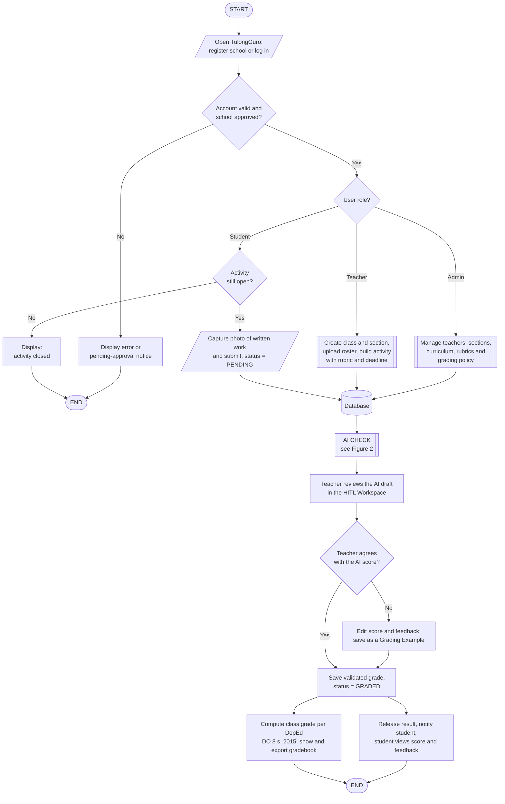
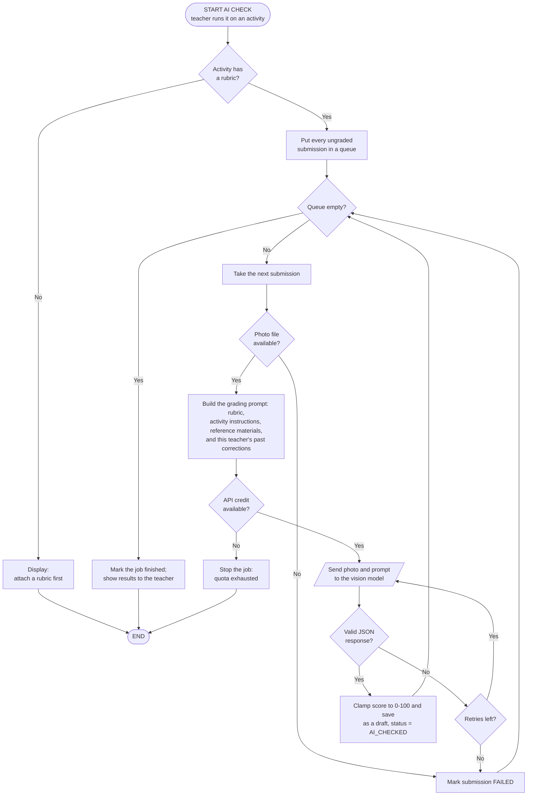

# TulongGuro — System Flowchart and Pseudocode

For inclusion in Chapter 3 (Methodology / System Design).

---

## Figure 1. System Flowchart (Overall)



**Plain-text version** — for redrawing in Word, Visio, or draw.io with standard
ANSI flowchart symbols (oval = terminal, parallelogram = input/output,
rectangle = process, diamond = decision, cylinder = database,
double-sided rectangle = predefined process):

```
                          (START)
                             |
              [/ Open TulongGuro: register or log in /]
                             |
              < Account valid and school approved? > --No--> [Error / pending notice] --> (END)
                             |Yes
                       < User role? >
             /               |                    \
          Admin           Teacher               Student
            |                |                     |
   [[Manage teachers,  [[Create class,      < Activity still open? > --No--> [Closed] --> (END)
     curriculum,         roster, activity          |Yes
     rubrics, policy]]   + rubric]]         [/ Capture photo and submit (PENDING) /]
            \                |                     /
             \               |                    /
              +----------> ((DATABASE)) <--------+
                             |
                  [[ AI CHECK - see Figure 2 ]]
                             |
              [Teacher reviews the AI draft (HITL Workspace)]
                             |
              < Teacher agrees with the AI score? > --No--> [Edit score and feedback;
                             |Yes                             save as Grading Example]
                             |                                        |
              [Save validated grade (GRADED)] <---------------------- +
                             |
              +--------------+--------------+
              |                             |
   [Release, notify student,     [Compute DepEd DO 8 s. 2015 grade;
    student views feedback]       show and export gradebook]
              |                             |
              +---------> (END) <-----------+
```

---

## Figure 2. AI-Assisted Grading Subprocess (Human-in-the-Loop)



---

## Pseudocode

### Module 1 — Main Program

```
BEGIN TulongGuro
    DISPLAY landing page
    IF user is not registered THEN
        CALL RegisterSchool()
    END IF
    user <- CALL Authenticate()
    IF user IS NULL THEN
        DISPLAY "Invalid credentials"
        EXIT
    END IF

    CASE user.role OF
        "ADMIN"   : CALL AdminDashboard(user)
        "TEACHER" : CALL TeacherDashboard(user)
        "STUDENT" : CALL StudentDashboard(user)
    END CASE
END
```

### Module 2 — Authentication

```
FUNCTION Authenticate()
    INPUT username, password
    account <- SELECT user FROM Database WHERE username = username
    IF account IS NULL THEN
        RETURN NULL
    END IF
    IF NOT PasswordMatches(password, account.passwordHash) THEN
        RETURN NULL
    END IF
    IF account.school.status <> "APPROVED" THEN
        DISPLAY "Your school is still pending approval"
        RETURN NULL
    END IF
    token <- GenerateSessionToken(account)
    RETURN account WITH token
END FUNCTION
```

### Module 3 — Student Submission

```
PROCEDURE SubmitWork(student, activity)
    IF activity.deadline HAS PASSED AND no late window THEN
        DISPLAY "This activity is already closed"
        RETURN
    END IF
    IF activity.attemptsUsed >= activity.maxAttempts THEN
        DISPLAY "No attempts left"
        RETURN
    END IF

    INPUT photo(s) of handwritten work          // camera or file upload
    image    <- CombinePagesIntoOneImage(photo)
    imageUrl <- UploadToStorage(image)

    IF a submission already exists THEN
        UPDATE submission SET imageUrl, status = "PENDING",
                              attemptCount = attemptCount + 1
    ELSE
        INSERT submission (student, activity, imageUrl, status = "PENDING")
    END IF

    DISPLAY "Submitted. Waiting for your teacher's checking."
END PROCEDURE
```

### Module 4 — AI Checking

```
PROCEDURE RunAiCheck(teacher, activity)
    IF activity.rubric IS EMPTY THEN
        DISPLAY "Attach a rubric before running the AI check"
        RETURN
    END IF

    queue <- SELECT submissions WHERE activity = activity AND status = "PENDING"

    FOR EACH submission IN queue DO
        image <- LoadImage(submission.imageUrl)
        IF image NOT FOUND THEN
            SET submission.state <- "FAILED"
            CONTINUE
        END IF

        // --- Build the grading prompt ---
        prompt <- activity.instructions + activity.rubric
        prompt <- prompt + activity.referenceMaterials       // at most 3 files

        examples <- SELECT TOP 3 GradingExample
                    WHERE teacher       = teacher
                      AND activityType  = activity.type
                      AND gradeLevel    = activity.class.gradeLevel
                    ORDER BY dateCreated DESC
        prompt <- prompt + examples                          // few-shot calibration

        IF no API credential is available THEN
            STOP the job
            DISPLAY "AI checking is temporarily unavailable"
            RETURN
        END IF

        attempts <- 0
        REPEAT
            response <- SendToVisionModel(image, prompt)
            attempts <- attempts + 1
        UNTIL response IS VALID JSON OR attempts = MAX_RETRIES

        IF response IS NOT VALID THEN
            SET submission.state <- "FAILED"
            CONTINUE
        END IF

        score <- Clamp(response.score, 0, 100)
        IF response.score <> score THEN
            SET submission.scoreOutOfRange <- TRUE           // flag for the teacher
        END IF

        UPDATE submission SET aiScore    = score,
                              aiFeedback = response.feedback,
                              status     = "AI_CHECKED"      // DRAFT only
    END FOR

    DISPLAY "AI check finished. Please review the results."
END PROCEDURE
```

### Module 5 — Human-in-the-Loop Validation and Release

```
PROCEDURE ValidateSubmission(teacher, submission)
    DISPLAY submission.image, submission.aiScore, submission.aiFeedback

    INPUT finalScore, finalFeedback              // teacher may keep or change these

    IF finalScore < 0 OR finalScore > 100 THEN
        DISPLAY "Score must be between 0 and 100"
        RETURN
    END IF

    IF finalScore <> submission.aiScore OR finalFeedback <> submission.aiFeedback THEN
        // Store the correction so later prompts imitate this teacher
        INSERT GradingExample (teacher, activityType, gradeLevel,
                               aiScore, aiFeedback,
                               teacherScore    = finalScore,
                               teacherFeedback = finalFeedback)
    END IF

    IF submission WAS ALREADY RELEASED AND the grade changed THEN
        SET submission.releasedAt <- NULL        // withdraw until released again
        DISPLAY "The grade was withdrawn. Release it again when ready."
    END IF

    UPDATE submission SET hitlScore    = finalScore,
                          hitlFeedback = finalFeedback,
                          status       = "GRADED"
END PROCEDURE


PROCEDURE ReleaseResults(teacher, activity)
    FOR EACH submission IN activity WHERE status = "GRADED" DO
        SET submission.releasedAt <- CurrentDateTime
        CALL SendNotification(submission.student, "Your work has been checked")
        CALL AwardBadges(submission.student, submission.hitlScore)
    END FOR
END PROCEDURE
```

### Module 6 — Grade Computation (DepEd Order No. 8, s. 2015)

```
FUNCTION ComputeGrade(studentSubmissions, weights)
    // weights = { WrittenWork, PerformanceTask, QuarterlyAssessment }

    FOR EACH component IN {WW, PT, QA} DO
        earned[component]   <- SUM of scores of validated, non-excused work
        possible[component] <- SUM of highest possible scores
        IF possible[component] > 0 THEN
            percent[component] <- (earned[component] / possible[component]) * 100
        ELSE
            percent[component] <- NONE
        END IF
    END FOR

    IF no component has any grade THEN
        RETURN "No grade yet"
    END IF

    // Re-distribute the weights of the components that have no grade yet
    totalWeight  <- SUM of weights of components that have grades
    initialGrade <- 0
    FOR EACH component WITH a grade DO
        initialGrade <- initialGrade
                        + percent[component] * (weights[component] / totalWeight)
    END FOR

    // Transmutation table, expressed as its two linear segments
    IF initialGrade >= 60 THEN
        step <- 1.6
    ELSE
        step <- 4.0
    END IF
    finalGrade <- 75 + FLOOR((initialGrade - 60) / step)
    finalGrade <- Clamp(finalGrade, 60, 100)

    IF finalGrade >= 75 THEN
        remarks <- "Passed"
    ELSE
        remarks <- "Failed"
    END IF

    RETURN initialGrade, finalGrade, remarks
END FUNCTION
```

---

## Notes for the Write-up

1. **Human-in-the-loop is the control.** The AI never writes a grade of record.
   Every AI output is stored as a *draft* (`status = AI_CHECKED`); it becomes a
   grade only after a teacher validates it, and becomes visible to the student
   only after a separate, deliberate *release*.
2. **The system learns the teacher's marking style.** Each teacher correction is
   saved as a Grading Example and fed back into later prompts as few-shot
   demonstrations, scoped to the same teacher, activity type, and grade level.
3. **Grades follow DepEd Order No. 8, s. 2015** — component weighting, initial
   grade, and the transmutation table.
